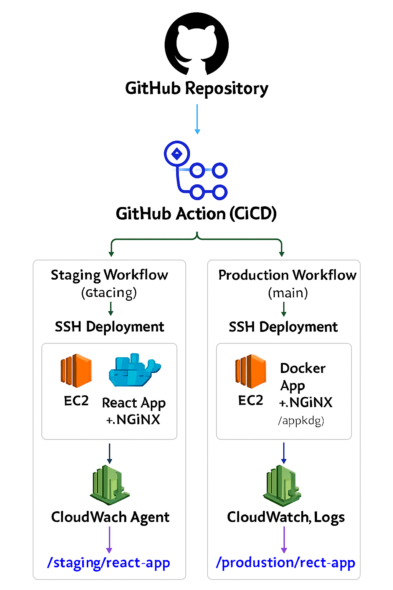

# Project: React App with Docker, Staging & Production Deployment
## Overview
This project demonstrates a full CI/CD workflow for deploying a React application to staging and production environments on AWS EC2 using Docker and monitoring logs via Amazon CloudWatch.

1. Staging and Production run on separate EC2 instances.
2. CI/CD pipeline is handled using GitHub Actions.
3. Logs are collected in CloudWatch Log Groups.
4. Docker is used to build, deploy, and serve the React application via Nginx.

## Infrastructure Diagram
 
  

## Deployment Flow

### Staging Branch

1. Push code to staging → triggers staging workflow
2. GitHub Actions SSH to staging EC2
3. Pull latest code, build Docker image, run container
4. CloudWatch agent collects logs to /staging/react-app

**Screenshots:**
- Docker container on EC2:  
  
- EC2 dashboard:  
  
- CloudWatch Logs:  
  
- CI/CD Workflow:  
  
- Application running in browser:  
  

### Production Branch

1. Merge PR to main → triggers production workflow
2. GitHub Actions SSH to production EC2
3. Pull latest code, build Docker image, run container
4. CloudWatch agent collects logs to /production/react-app

**Screenshots:**
- Docker container on EC2:  
  
- EC2 dashboard
  
- CloudWatch Logs:  
  
- CI/CD Workflow:  
  
- Application running in browser:  
  
